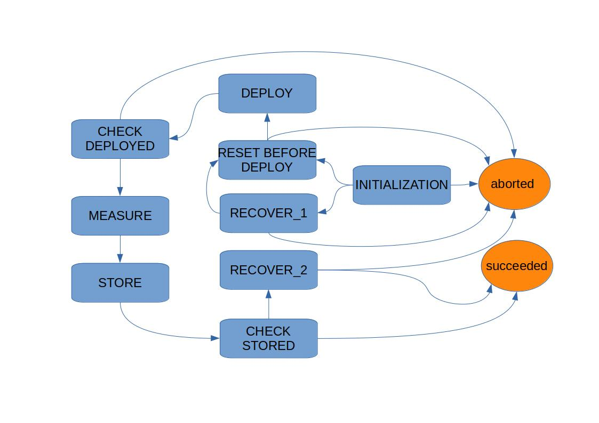
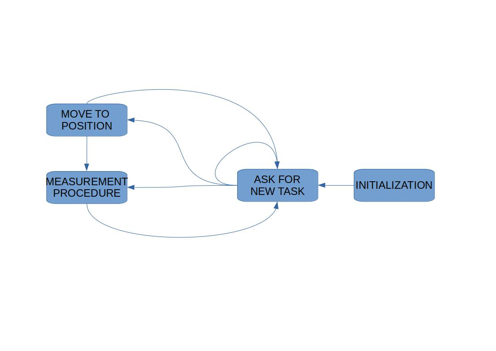

# License (MIT)
Copyright 2021, AstroCeNT

Permission is hereby granted, free of charge, to any person obtaining a copy of this software and associated documentation files (the "Software"), 
to deal in the Software without restriction, including without limitation the rights to use, copy, modify, merge, publish, distribute, sublicense, 
and/or sell copies of the Software, and to permit persons to whom the Software is furnished to do so, subject to the following conditions:

The above copyright notice and this permission notice shall be included in all copies or substantial portions of the Software.

THE SOFTWARE IS PROVIDED "AS IS", WITHOUT WARRANTY OF ANY KIND, EXPRESS OR IMPLIED, INCLUDING BUT NOT LIMITED TO THE WARRANTIES OF MERCHANTABILITY, 
FITNESS FOR A PARTICULAR PURPOSE AND NONINFRINGEMENT. IN NO EVENT SHALL THE AUTHORS OR COPYRIGHT HOLDERS BE LIABLE FOR ANY CLAIM, 
DAMAGES OR OTHER LIABILITY, WHETHER IN AN ACTION OF CONTRACT, TORT OR OTHERWISE, ARISING FROM, OUT OF OR IN CONNECTION WITH THE SOFTWARE OR THE USE 
OR OTHER DEALINGS IN THE SOFTWARE.

AstroCeNT: Particie Astrophysics Science and Technology Centre
Agreement MAB / 2018/7 dated 03/07/2018 (Umowa MAB/2018/7 z dn. 03.07.2018)
The project is co-financed by the European Regional Development Fund under the Intelligent Development Operational Program
(Projekt jest współfinansowany ze środków Europejskiego Funduszu Rozwoju Regionalnego w ramach Programu Operacyjnego Inteligentny Rozwój)
and also from the Foundation for Polish Science grant TEAM/2016-3/19.

Author: Marek Wiejak

# seismic_bot
ROS packages for autonomous mobile seismic measurement platform.

Info about hardware configuration can be found at: https://github.com/MarekWiejak/mecanum

# General description
The robot platform, for which this package has been developed, contains several hardware pieces (stepper motor, seismic sensor, limit switches, etc.). The key idea of designed software is to provide an independent interface for each device* in the form of ROS Action and Service servers. Therefore, interactions with hardware are accessible from anywhere in ROS system, which is useful for testing and designing complex behavior patterns. The robot's behavior is defined by state machines, where each state usually exploits one or more Services and/or Actions. The robot has two main purposes: navigating in the environment and performing measurement procedure. Those tasks are actually independent, so a "crane module" has been distinct, being responsible for the measurement procedure.

*Not always true, as some servers might require other devices for advanced tasks, e.g. "recover sensor from unknown position" being an Action advertised by stepper motor server requires access to "monitor limit switch state" action to know when the sensor had been recovered and the motor should be stopped.

## Crane module
The measurement procedure consists of: sensor deployment, actual measurement, sensor storing, with additional safety checks and sensor recovery procedure if required. The procedure order is determined by a "crane module state machine" and is wrapped into a ROS Action, so it can be performed simply by calling the aforementioned action. Note, that even though devices like a stepper motor or limit switches are physically parts of a "crane module", they are not accessed exclusively by the crane module state machine.

### Crane module state machine
Starting from INITIALIZATION state, the position of seismic sensor is checked, if the sensor is not present in "stored" position, recovery attempt is taken. If successful, position is calibrated and deployment procedure starts. When deployment ends, a check if the sensor left its initial position is performed (there is no limit switch at "deployed" position, so it is assumed, that if the sensor managed to leave "stored" position, it successfully reached "deployed" position). Measurement is taken and storing action begins. The position is checked, whether the sensor reached "stored" position and if not recovery attempt is taken. The machine returns "succeeded" state if managed to perform measurement and restore the sensor, and "aborted" if an unsolvable issue had been encountered.

## Robot behavior state machine
On the highest level of control, the robot must choose whether it should perform a navigation task, or measurement task. Those task (and a task of deciding what to do next itself) are member states of a "robot state machine" implemented in robot_state_machine package. Currently, no algorithm providing "on the fly" decision regarding a new task has been implemented, instead, a decision simulator forcing the robot into performing measurement at predefined locations has been provided (task_determiner package). The simulator provides and is accessed via ROS Service interface, so can easily be replaced with an actual algorithm.

# Using the package
No GUI is provided, so using the package is quite crude and requires using console commands.

[TODO] Add a section about package instalation.

## Launch files
There are several launch files provided inside "seismic_bringup" package for convenience of the user:
- seismic_basic - should be launched always at robot start, as it contains basic control and communication as well as crane module features
- gmapping - runs features required for mapping the environment (mutually exclusive with seismic_main)
- seismic_main - runs features required for performing complex behavior defined in general state machine, requires that a map of the environment has been created, (mutually exclusive with gmapping)

Other launch files are included from inside the aforementioned three, and should be used by developer rather than user.

## Configuration files
seismic_brigup package contains configuration files, that do not need to be changed if no change in software or hardware is made.

## Creating and using maps
To map the environment:
- launch gmapping.launch file from seismic_bringup package
- use ROS-Mobile android app (http://wiki.ros.org/ROS-Mobile) (more in seismic_basic package description)
- save the map run command: "rosrun map_server map_saver -f "path_to_seismic_bot_package"/maps/"name_of_the_map"

To use created map:
- Change the path to the map inside seismic_bot/seismic_bringup/launch/amcl.launch file to that of your map

## Running test with decision simulator
Predefined points, that are going to be used in navigation task, are hardcoded in simulator script and must be adjusted in order to be used in arbitrary environment, it can be done with the following steps:
- create map of the environment (with gmapping package)
- launch move_base.launch from seismic_bringup package (this is done in order to just publish recorded map)
- run rviz and add "map" to display, choose proper topic
- run command "rostopic echo /clicked_point"
- choose "Publish Point" tool from top bar in rviz and click on desired location on the map
- observe point coordinates in /clicked_point topic
- use those coordinates to modify points and POS_LIST in a top part of seismic_bot/task_determiner/scripts/fake_task_generator.py
- kill move_base.launch 

# Further development
- If proper "new task" package is added, adjust "new_task_service_name" parameter in seismic_bot/seismic_bringup/config/robot_sm_params.yaml configuration file
- If proper "sensor measurement" package is added, adjust "measurement_action_name" parameter in seismic_bot/seismic_bringup/config/robot_sm_params.yaml configuration file
- The robot's coordinate frame used in navigation are bound with the central point of the robot, not with the position of the seismic sensor. This issue wasn't addressed, as the sensor would preferably be positioned in the center of the robot in its final version, but should be taken into consideration if serious performance tests are to be conducted on a prototype.

